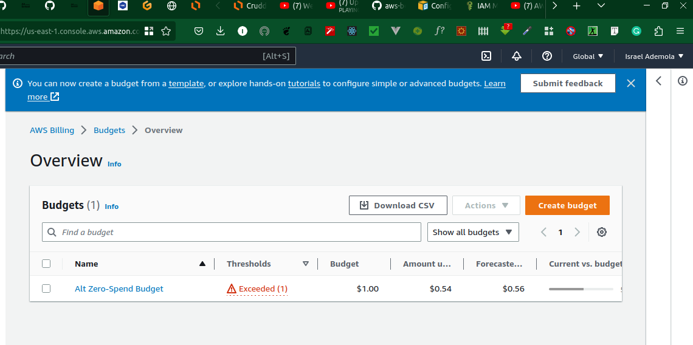

# Week 0 — Billing and Architecture

### Recreate Conceptual Diagram in Lucid Charts
I created the conceptual diagram for the cruddur app
[Link to the Concept diagram](https://lucid.app/lucidchart/bd711994-49c9-4653-a165-d75570e2b0ea/edit?viewport_loc=140%2C208%2C1480%2C691%2C0_0&invitationId=inv_482c1861-1783-4a81-9738-85a3fd70659a)

### Recreate Logical Architectual Diagram in Lucid Charts
I created the logical diagram for the cruddur app
[Link to the Logical diagram](https://lucid.app/lucidchart/ed9090c3-75ab-4606-ae45-23fd44c6ef2c/edit?viewport_loc=67%2C143%2C1480%2C691%2C0_0&invitationId=inv_a3821f4d-8fca-458f-9ac9-b9c4b66eaefd)

### Create an Admin User
Created and admin user via the IAM service on AWS console

### Installed AWS CLI
I Setup AWS cli on git pod

### Create a Budget
I created a $1 budget; I did not create another Budget because of the fear of not leaving the trenches

