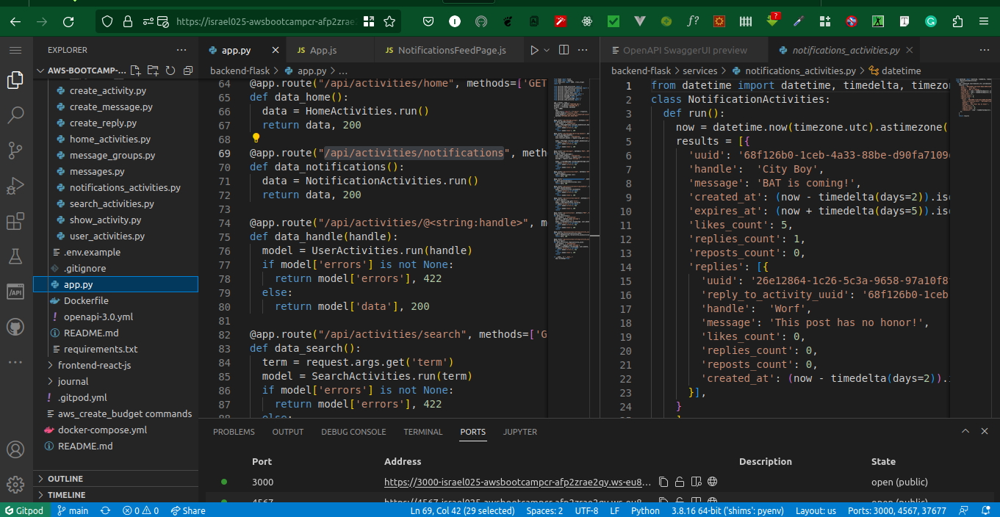

# Week 1 — App Containerization

### Containerize Application (Dockerfiles, Docker Compose)

I was able to containerize the cruddur app by firstly creating a dockerfile for each of the backend and frontend apps and the created a docker-compose file for the app as a whole

> The frontend Dockerfile

> The Docker-compose file and proof it's running

> The Docker-compose file and proof of ports it's running on

> Proof that both the backend and frontend app runs after running docker-compose up command

### Write a Flask Backend Endpoint for Notifications
following the instruction on the video, I was able to successfully write the notification flask backend endpoint

> Notification open api endpoint

> Notification flask route definition

> Proof that the Notification flask backend works

### Write a React Page for Notifications 	
I was also able to write the notification react page following the instruction on the video

> Notification react page

> Notification UI page

## Run DynamoDB Local Container and ensure it works

## Run Postgres Container and ensure it works
